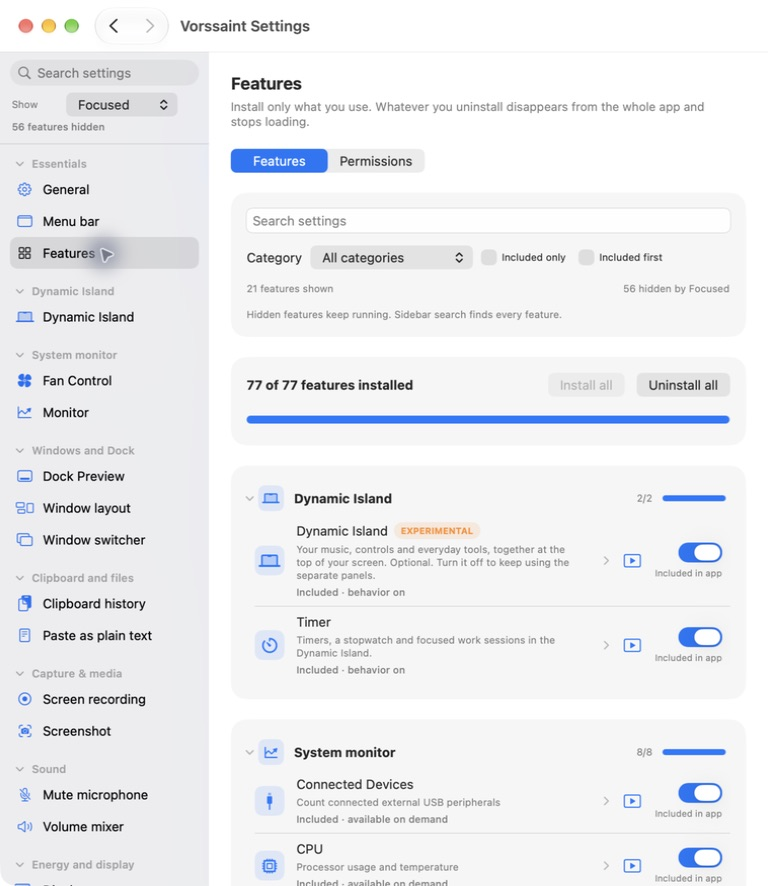

# Settings discovery

Vorssaint uses one feature taxonomy across Settings, Features, shortcuts,
onboarding and Command Bar headings. Capture & Media and Apps & Maintenance
have their own categories. The sidebar and Features catalog sort tools by their
localized names within each category; the island precedes its extensions.

## Feature views

Focused presents everyday tools plus Dynamic Island and all system monitor settings. Expanded adds workflows. Everything exposes the
full catalog. Switching view changes presentation only: it does not remove
features, alter their saved options or stop services. Search reaches the full
catalog from the sidebar at every level; the Features tab filters within its
selected view. A destination reached through sidebar search remains
selectable even outside the current level. Existing users start with full
visibility so an update does not hide their settings.

Bulk Install all and Uninstall all offer Undo, restoring inclusion, explicitly
saved on/off choices and unset preferences without changing the chosen view.

Feature inclusion and behavior are different controls. Removing a feature
synchronizes its service immediately and hides its entry points. Including it
again preserves saved off choices. An included feature with its behavior off
has an explicit Turn on action. On-demand features and island extensions that
need their parent have distinct status labels. These labels describe the saved
configuration, not live permission grants or whether an on-demand task is running.

## Preview and presentation

Previews are native vector illustrations rendered from fictional content.
They do not read the desktop, clipboard, files, camera, devices, or media
metadata. Some represent a workflow rather than an exact product screenshot;
they are labeled illustrated examples. They pause with the Settings window
hidden, support Play/Pause, and show a still frame for Reduce Motion.

Settings controls use solid cards and standard switches. The Show selector lives
in a fixed header beside sidebar search, and reports how many features are
hidden without changing their availability. Navigation uses the standard
macOS grouped back and forward buttons. The older Quit on
Close, Keyboard Debounce, Quit Protection and URL Cleaner pages use the same
page shell, card spacing and preview affordance as the redesigned settings.

## Design references

[PrusaSlicer modes](https://help.prusa3d.com/article/simple-advanced-expert-modes_1765)
progressively reveal more controls. Vorssaint applies that idea to discovery,
keeping changes to running features explicit and reviewable.

[Apple settings guidance](https://developer.apple.com/design/human-interface-guidelines/settings)
explains how too many settings can reduce approachability and make individual
controls difficult to find. Shared categories, alphabetical ordering, search,
and visual examples provide complementary ways to discover a feature.

## Verification

The test harness executes production availability, bulk Undo and Turn on
methods against isolated UserDefaults with service synchronization recorded.
It covers saved off choices, hardware gating,
progressive views, status distinctions and routes outside the chosen view.
Feature, settings, preferences, updates, Command Bar, recorder, keyboard and
utility suites cover the surrounding contracts. Developer builds are checked
with self-test, code-sign verification and native UI inspection.

## Screenshots

Focused hides 56 catalog features and leaves all 77 included. The search
field in this catalog filters visible features; sidebar search can still find
any feature. The removed setup card is shown for comparison.

